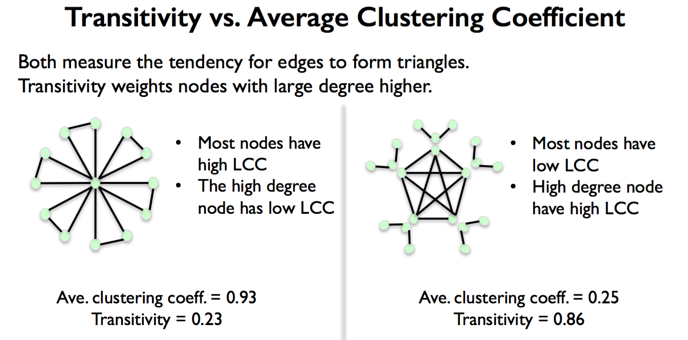
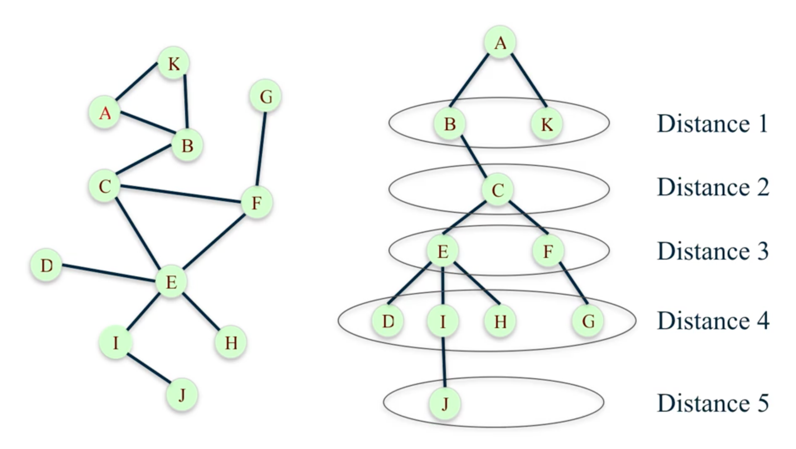

Network Connectivity
====================

Clustering
----------------
Clustering coefficients measures the degree to which nodes in a network tend to cluster or form triangles.

Local Clustering Coefficient
*****************************
Find the clustering of a particular node.

# pairs of A's friends who are friends with each other / # all possible pairs of A's friends

.. code:: python

  # G is a graph, A is a node
  nx.clustering(G, 'A') 

Global Clustering Coefficient
*****************************

**Average clustering** of entire network by averaging all local clustering coefficient values of all nodes.

.. code:: python

  nx.average_clustering(G)
  
  
**Transitivity** is the ratio of number of triangles and number of “open triads”. 
Puts larger weight on high degree nodes.

.. code:: python

  nx.transitivity(G)
  
  

    From University of Michigan, Python for Data Science Coursera Specialization
    
    
Distance
---------

Shortest Path
**************
Shortest distance from a start node to the end node.

.. code:: python

  nx.shortest_path(G, 'A', 'H')
  # ['A', 'B', 'C', 'E', 'H']
  
  nx.shortest_path_length(G, 'A', 'H')
  # 4

Longest Path
************

**Eccentricity** of a node n is the largest distance between n and all other nodes.

.. code:: python

  nx.eccentricity(G)
  # {'A': 5, 'B': 4, 'C': 3, 'D': 4, 'E': 3, 'F': 3, 'G': 4, 'H': 4, 'I': 4, 'J': 5, 'K': 5}  

**Diameter** maximum distance between any pair of nodes.

.. code:: python

  nx.diameter(G)
  # 5

**Radius** of a graph is the minimum eccentricity.

.. code:: python

  nx.radius(G)
  # 3
    
    
Breadth First Search
*********************
Find the distance from one node to all other nodes.

One method is the Breadth First Search, which is a systematic and efficient procedure for computing distances 
from a node to all other nodes in a large network by “discovering” nodes in layers.

.. code:: python

  T = nx.bfs_tree(G, 'A') 
  T.edges()
  # [('A', 'K'), ('A', 'B'), ('B', 'C'), ('C', 'E'), ('C', 'F'), ('E', 'I'), ('E', 'H'), ('E', 'D'), ('F', 'G'), ('I', 'J')]
  
  nx.shortest_path_length(G, 'A')
  # {'A': 0, 'B': 1, 'C': 2, 'D': 4, 'E': 3, 'F': 3, 'G': 4, 'H': 4, 'I': 4, 'J': 5, 'K': 1}
  

    From University of Michigan, Python for Data Science Coursera Specialization
  
  
Other Distance Measures
************************

**Average Distance** between every pair of nodes.

.. code:: python

  nx.average_shortest_path_length(G)
  # 2.52727272727
  

**Periphery** of a graph is the set of nodes that have eccentricity equal to the diameter.

.. code:: python

  nx.periphery(G)
  # ['A', 'K', 'J']

**Center** of a graph is the set of nodes that have eccentricity equal to the radius.

.. code:: python

  nx.center(G)
  # ['C', 'E', 'F']
  
  
Connectivity
------------

Unidirected Graph
******************

**Connected**

An undirected graph is connected if, for every pair nodes, there is a path between them.

.. code:: 
  
  nx.is_connected(G)

**Graph Components**

To show nodes for each graph component.

.. code:: python
   
  # show all nodes for each components
  sorted(nx.connected_components(G))

  # show all nodes in component containing 'M'
  nx.node_connected_component(G, 'M')

Directed Graph
******************

**Strongly / Weakly Connected**

A directed graph is strongly connected if, for every pair nodes u and v, 
there is a directed path from u to v and a directed path from v to u.

.. code:: python

  nx.is_strongly_connected(G)

A directed graph is weakly connected if replacing all directed edges 
with undirected edges produces a connected undirected graph.

.. code:: python

  nx.is_weakly_connected(G)

**Graph Components**

A strongly connected graph component (subset of nodes) have 
(1) every node in the subset has a directed path to every other node. 
(2) no other node has a directed path to every node in the subset.

.. code:: python

  sorted(nx.strongly_connected_components(G))
  # [{M}, {L}, {K}, {A, B, C, D, E, F, G, J, N, O}, {H, I}]

