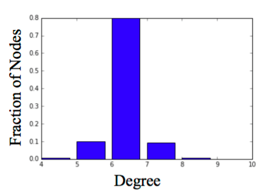
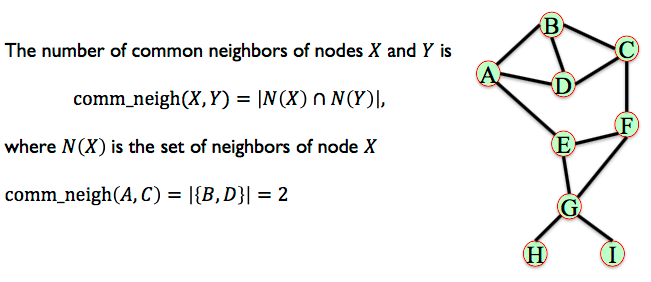
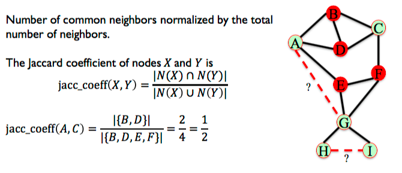
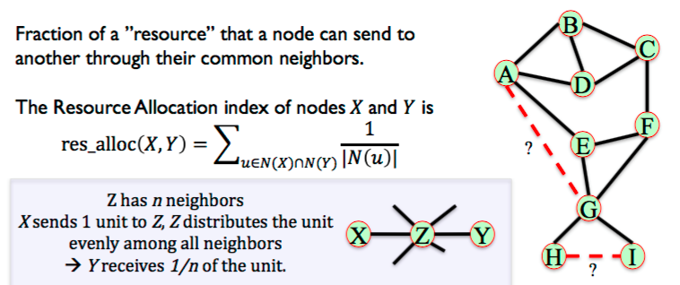
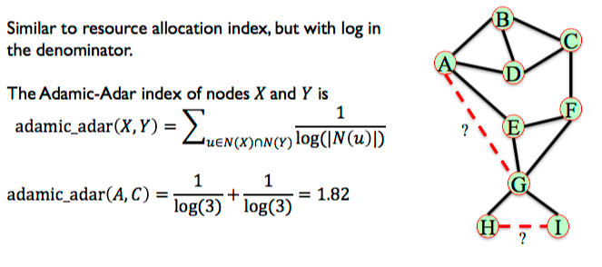
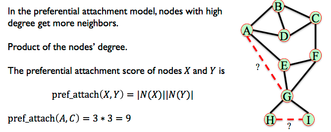
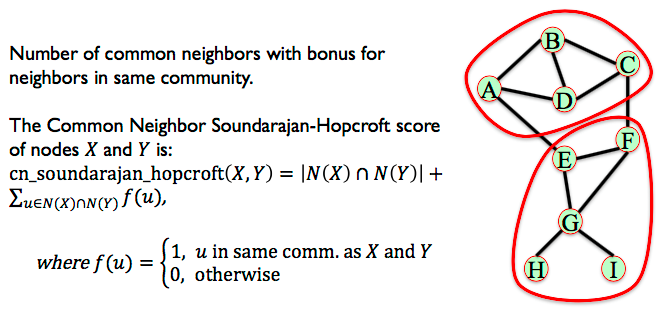
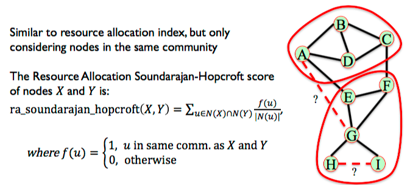

Evolution
==========

The degree of a node in an undirected graph is the number of neighbors it has.

The **degree distribution** of a graph is the probability distribution of the degrees over the entire network.

.. code:: python

  degrees = G.degree()
  degree_values = sorted(set(degrees.values()))
  histogram = [list(degrees.values()).count(i)/float(nx.number_of_nodes( G)) \
              for i in degree_values]

  import matplotlib.pyplot as plt

  plt.bar(degree_values,histogram)
  plt.xlabel('Degree')
  plt.ylabel('Fraction of Nodes')
  plt.show()

.. figure:: images/degreed.png
    :width: 400px
    :align: center
    :height: 100px
    :alt: alternate text
    :figclass: align-center

    From University of Michigan, Python for Data Science Coursera Specialization

Preferential Attachment Model
-----------------------------
The degree distribution of a graph is the probability distribution of the degrees over the entire network.

 • Many real networks have degree distributions that look like power laws (𝑃𝑘 =C𝑘^-a).
 • Models of network generation allow us to identify mechanisms that give rise to observed patterns in real data.
 • The Preferential Attachment Model produces networks with a power law degree distribution.

 .. figure:: images/degreed2.png
     :width: 600px
     :align: center
     :height: 100px
     :alt: alternate text
     :figclass: align-center

     From University of Michigan, Python for Data Science Coursera Specialization

``nx.barabasi_albert_graph(n, m)`` returns a network with n nodes.
Each new node attaches to m existing nodes according to the Preferential Attachment model.

.. code:: python

  G = nx.barabasi_albert_graph(1000000,1)
  degrees = G.degree()
  degree_values = sorted(set(degrees.values()))
  histogram = [list(degrees.values().count(i))/float(nx.number_of_node s(G)) \
                for i in degree_values]

  import matplotlib.pyplot as plt

  plt.plot(degree_values,histogram, 'o')
  plt.xlabel('Degree')
  plt.ylabel('Fraction of Nodes')
  plt.xscale('log')
  plt.yscale('log')
  plt.show()

Small World Model
------------------
Social networks tend to have high clustering coefficient and small average path length.

 • Start with a ring of 𝑛 nodes, where each node is connected to its 𝑘 nearest neighbors.
 • Fix a parameter 𝑝 ∈ [0,1]
 • Consider each edge 𝑢, 𝑣 . With probability 𝑝, select a node 𝑤 at random and rewire the edge (𝑢, 𝑣) so it becomes (𝑢, 𝑤).

.. code:: python

  G = nx.watts_strogatz_graph(1000,6,0.04)
  degrees = G.degree()
  degree_values = sorted(set(degrees.values()))
  histogram = [list(degrees.values()).count(i)/float(nx.number_of_node s(G)) \
                for i in degree_values]

  import matplotlib.pyplot as plt

  plt.bar(degree_values,histogram)
  plt.xlabel('Degree')
  plt.ylabel('Fraction of Nodes')
  plt.show()

    
    From University of Michigan, Python for Data Science Coursera Specialization
    
Variants of the small world model in NetworkX:

 • Small world networks can be disconnected, which is sometime undesirable.
 • ``nx.connected_watts_strogatz_graph(n, k, p, t)`` runs watts_strogatz_graph(n, k, p) up to t times, until it returns a connected small world network.
 • ``nx.newman_watts_strogatz_graph(n, k, p)`` runs a model similar to the small world model, sbut rather than rewiring edges, new edges are added with probability 𝑝.

Link Prediction
----------------
Given a network, can we predict which edges will be formed in the future?

Common Neighbours
********************
The number of common neighbors of nodes 𝑋 and 𝑌.

    
    From University of Michigan, Python for Data Science Coursera Specialization

.. code:: python

  common_neigh = [(e[0], e[1], len(list(nx.common_neighbors(G, e[0], e[1])))) \
                  for e in nx.non_edges(G)]
  
  sorted(common_neigh,key=operator.itemgetter(2), reverse = True 
  print (common_neigh)
  # [('A', 'C', 2), ('A', 'G', 1), ('A', 'F', 1), 
  # ('C', 'E', 1), ('C', 'G', 1), ('B', 'E', 1), 
  # ('B', 'F', 1), ('E', 'I', 1), ('E', 'H', 1), 
  # ('E', 'D', 1), ('D', 'F', 1), ('F', 'I', 1), 
  # ('F', 'H', 1), ('I', 'H', 1), ('A', 'I', 0), 
  # ('A', 'H', 0), ('C', 'I', 0), ('C', 'H', 0), 
  # ('B', 'I', 0), ('B', 'H', 0), ('B', 'G', 0), 
  # ('D', 'I', 0), ('D', 'H', 0), ('D', 'G', 0)]

Jaccard Coefficient
********************
Number of common neighbors normalized by the total number of neighbors.

    
    From University of Michigan, Python for Data Science Coursera Specialization

.. code:: python

  L = list(nx.jaccard_coefficient(G))
  
  L.sort(key=operator.itemgetter(2), reverse = True)
  print(L)
  # [('I', 'H', 1.0), ('A', 'C', 0.5), ('E', 'I', 0.3333333333333333), 
  # ('E', 'H', 0.3333333333333333), ('F', 'I', 0.3333333333333333), 
  # ('F', 'H', 0.3333333333333333), ('A', 'F', 0.2), ('C', 'E', 0.2), 
  # ('B', 'E', 0.2), ('B', 'F', 0.2), ('E', 'D', 0.2), ('D', 'F', 0.2), 
  # ('A', 'G', 0.16666666666666666), ('C', 'G', 0.16666666666666666), 
  # ('A', 'I', 0.0), ('A', 'H', 0.0), ('C', 'I', 0.0), ('C', 'H', 0.0), 
  # ('B', 'I', 0.0), ('B', 'H', 0.0), ('B', 'G', 0.0), ('D', 'I', 0.0), 
  # ('D', 'H', 0.0), ('D', 'G', 0.0)]

Resource Allocation
********************
Fraction of a ”resource” that a node can send to another through their common neighbors.

    
    From University of Michigan, Python for Data Science Coursera Specialization
    
.. code:: python

  L = list(nx.resource_allocation_index(G))
  
  L.sort(key=operator.itemgetter(2), reverse = True)
  print(L)
  # [('A', 'C', 0.6666666666666666), ('A', 'G', 0.3333333333333333), 
  # ('A', 'F', 0.3333333333333333), ('C', 'E', 0.3333333333333333), 
  # ('C', 'G', 0.3333333333333333), ('B', 'E', 0.3333333333333333), 
  # ('B', 'F', 0.3333333333333333), ('E', 'D', 0.3333333333333333), 
  # ('D', 'F', 0.3333333333333333), ('E', 'I', 0.25), ('E', 'H', 0.25), 
  # ('F', 'I', 0.25), ('F', 'H', 0.25), ('I', 'H', 0.25), ('A', 'I', 0), 
  # ('A', 'H', 0), ('C', 'I', 0), ('C', 'H', 0), ('B', 'I', 0), 
  # ('B', 'H', 0), ('B', 'G', 0), ('D', 'I', 0), ('D', 'H', 0), ('D', 'G', 0)]

Adamic-Adar Index
********************
Similar to resource allocation index, but with log in the denominator.

    
    From University of Michigan, Python for Data Science Coursera Specialization
    
.. code:: python

  L = list(nx.adamic_adar_index(G))
  
  L.sort(key=operator.itemgetter(2), reverse = True)
  print(L)
  # [('A', 'C', 1.8204784532536746), ('A', 'G', 0.9102392266268373), 
  # ('A', 'F', 0.9102392266268373), ('C', 'E', 0.9102392266268373), 
  # ('C', 'G', 0.9102392266268373), ('B', 'E', 0.9102392266268373), 
  # ('B', 'F', 0.9102392266268373), ('E', 'D', 0.9102392266268373), 
  # ('D', 'F', 0.9102392266268373), ('E', 'I', 0.7213475204444817), 
  # ('E', 'H', 0.7213475204444817), ('F', 'I', 0.7213475204444817), 
  # ('F', 'H', 0.7213475204444817), ('I', 'H', 0.7213475204444817), 
  # ('A', 'I', 0), ('A', 'H', 0), ('C', 'I', 0), ('C', 'H', 0), 
  # ('B', 'I', 0), ('B', 'H', 0), ('B', 'G', 0), ('D', 'I', 0), ('D', 'H', 0), ('D', 'G', 0)]

Preferential Attachment
***********************
In the preferential attachment model, nodes with high degree get more neighbors.

    
    From University of Michigan, Python for Data Science Coursera Specialization
    
.. code:: python

  L = list(nx.preferential_attachment(G))
  
  L.sort(key=operator.itemgetter(2), reverse = True)
  print(L)
  # [('A', 'G', 12), ('C', 'G', 12), ('B', 'G', 12), ('D', 'G', 12), 
  # ('A', 'C', 9), ('A', 'F', 9), ('C', 'E', 9), ('B', 'E', 9), 
  # ('B', 'F', 9), ('E', 'D', 9), ('D', 'F', 9), ('A', 'I', 3), 
  # ('A', 'H', 3), ('C', 'I', 3), ('C', 'H', 3), ('B', 'I', 3), 
  # ('B', 'H', 3), ('E', 'I', 3), ('E', 'H', 3), ('D', 'I', 3), 
  # ('D', 'H', 3), ('F', 'I', 3), ('F', 'H', 3), ('I', 'H', 1)]

Community Common Neighbors
**************************
Some measures consider the community structure of the network for link prediction.
Assume the nodes in this network belong to different communities (sets of nodes).
Pairs of nodes who belong to the same community and have many common neighbors in their community are likely to form an edge.

Number of common neighbors with bonus for neighbors in same community.

    
    From University of Michigan, Python for Data Science Coursera Specialization
    
.. code:: python

  L = list(nx.cn_soundarajan_hopcroft(G))
  
  L.sort(key=operator.itemgetter(2), reverse = True) print(L)
  # [('A', 'C', 4), ('E', 'I', 2), ('E', 'H', 2), ('F', 'I', 2), 
  # ('F', 'H', 2), ('I', 'H', 2), ('A', 'G', 1), ('A', 'F', 1), 
  # ('C', 'E', 1), ('C', 'G', 1), ('B', 'E', 1), ('B', 'F', 1), 
  # ('E', 'D', 1), ('D', 'F', 1), ('A', 'I', 0), ('A', 'H', 0), 
  # ('C', 'I', 0), ('C', 'H', 0), ('B', 'I', 0), ('B', 'H', 0), 
  # ('B', 'G', 0), ('D', 'I', 0), ('D', 'H', 0), ('D', 'G', 0)]

Community Resource Allocation
*****************************
Similar to resource allocation index, but only considering nodes in the same community

    
    From University of Michigan, Python for Data Science Coursera Specialization
    
.. code:: python

  L = list(nx.ra_index_soundarajan_hopcroft(G)) 
  
  L.sort(key=operator.itemgetter(2), reverse = True) 
  print(L)
  # [('A', 'C', 0.6666666666666666), ('E', 'I', 0.25), 
  # ('E', 'H', 0.25), ('F', 'I', 0.25), ('F', 'H', 0.25), 
  # ('I', 'H', 0.25), ('A', 'I', 0), ('A', 'H', 0), ('A', 'G', 0), 
  # ('A', 'F', 0), ('C', 'I', 0), ('C', 'H', 0), ('C', 'E', 0), 
  # ('C', 'G', 0), ('B', 'I', 0), ('B', 'H', 0), ('B', 'E', 0), 
  # ('B', 'G', 0), ('B', 'F', 0), ('E', 'D', 0), ('D', 'I', 0), 
  # ('D', 'H', 0), ('D', 'G', 0), ('D', 'F', 0)]
