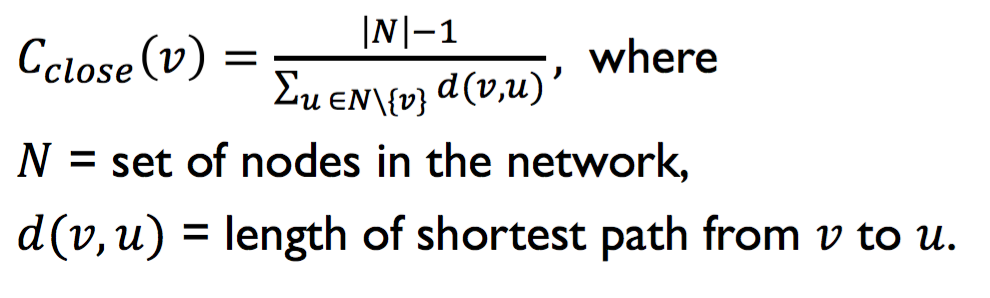
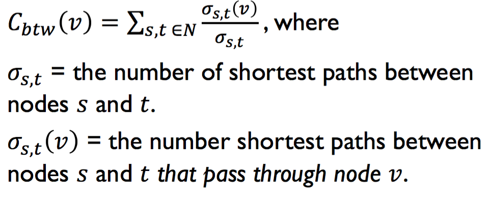
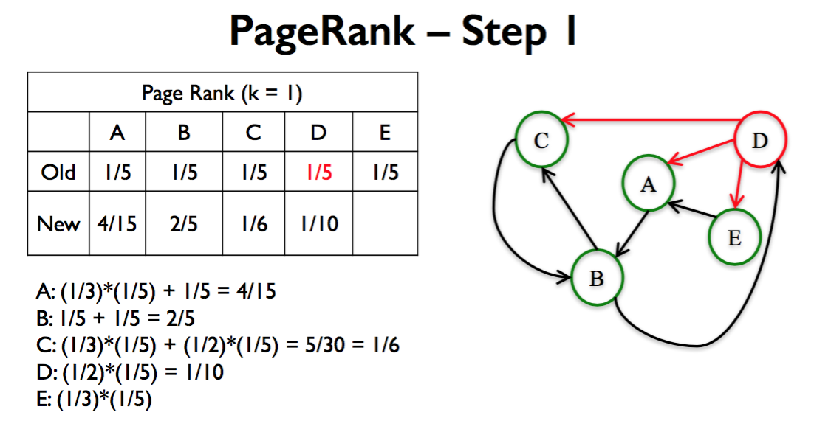
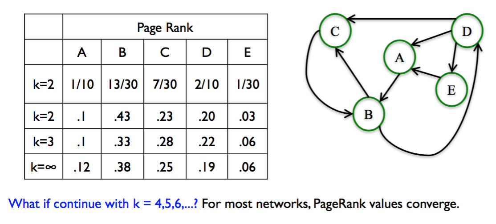
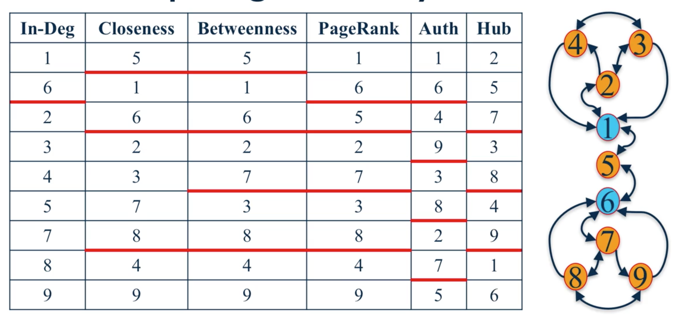

Network Centrality
===============================================

Centrality and other measures identify the most important nodes in a network.

Degree Centrality
-------------------
Assumption: Important nodes have many connections.

**Undirected networks**: Use degree.

𝐶𝑣 = d𝑣/(𝑁 - 1)
where 𝑁 is total number of nodes. Minus 1 to remove node in question
𝑑 is the degree of node 𝑣.

.. code:: python

  degCent = nx.degree_centrality(G)
  # gives a dictionary. key = node, value = centrality ratio
  degCent[34]
  .. 0.515 # 17/33

**Directed networks**: use in-degree or out-degree

.. code:: python

  # in-degree centrality
  indegCent = nx.in_degree_centrality(G) 
  indegCent[‘A’]
  
  # out-degree centrality
  indegCent = nx.out_degree_centrality(G) 
  indegCent[‘A’]
  

Closeness Centrality
---------------------
Assumption: important nodes are close to other nodes. 
It is calculated by (total number of nodes that node N can reach) / sum(shortest path of node N).

    From University of Michigan, Python for Data Science Coursera Specialization
    
    
.. code:: python

  closeCent =nx.closeness_centrality(G) 
  closeCent[32]
  .. 0.541
  
  # Manual calculation
  sum(nx.shortest_path_length(G,32).values()) 
  .. 61
  (len(G.nodes())-1)/61.
  .. 0.541
  
  
Normalisation (multiply a constant i.e., total # nodes in graph) is required for directed graphs, 
as node in question may only reach a few nodes in the entire graph.

.. code:: python

  nx.closeness_centrality(G, normalized= True)
  closeCent[‘L’]
  .. 0.071
  
  
  
Betweenness Centrality
----------------------
Assumption: important nodes are those that connect other nodes. 

What is the Betweenness Centrality of node v? 
This is between all possible paths between all sources & targets, 
taking into account the # shortest paths passing through that node v,
over the total # shortest paths from the sources to targets.

    From University of Michigan, Python for Data Science Coursera Specialization

**End Points**. Whether to include or exclude node v from as a source/target
 
**Normalization**. Divide by number of pairs of nodes.

**Approximation**. Computing betweenness centrality can be computationally expensive.
We can approximate computation by taking a subset of nodes.

.. code:: python

  btwnCent = nx.betweenness_centrality(G, endpoints = False, #include/exclude node v in source/target
                                          normalized = True,
                                          k = 10)  #approximation
  
  import operator
  sorted(btwnCent.items(), key=operator.itemgetter(1), reverse = True)[0:5]
  # [(1, 0.43763528138528146), 
  # (34, 0.30407497594997596),
  # (33, 0.14524711399711399),
  # (3, 0.14365680615680618),
  # (32, 0.13827561327561325)]

**Subsets**. We can define subsets of source and target nodes to compute betweenness centrality.

.. code:: python

  nx.betweenness_centrality_subset(G, [34, 33, 21, 30, 16, 27, 15, 23, 10], #source nodes
                                      [1, 4, 13, 11, 6, 12, 17, 7], #target nodes
                                      normalized=True)
  
  import operator                              
  sorted(btwnCent_subset.items(),key=operator.item getter(1), reverse=True)[0:5]
  # [(1, 0.04899515993265994), (34, 0.028807419432419434),
  # (3, 0.018368205868205867),
  # (33, 0.01664712602212602),
  # (9, 0.014519450456950456)]

**Edge betweenness centrality**. We can apply the same framework to find important edges instead of nodes.

.. code:: python

  btwnCent_edge = nx.edge_betweenness_centrality(G, normalized=True)
  
  import operator
  sorted(btwnCent_edge.items(), key=operator.itemgetter(1), reverse = True)[0:5]
  # [((1, 32), 0.12725999490705373), 
  # ((1, 7), 0.07813428401663694),
  # ((1, 6), 0.07813428401663694), 
  # ((1, 3), 0.0777876807288572), 
  # ((1, 9), 0.07423959482783014)]
  
  # similar function for subset
  nx.edge_betweenness_centrality_subset()

Basic Page Rank
---------------
PageRank assigns a score of importance to each node. 
Important nodes are those with many in-links from important pages.

    From University of Michigan, Python for Data Science Coursera Specialization
    

    From University of Michigan, Python for Data Science Coursera Specialization
    
**Steps of Basic PageRank**

 1. All nodes start with PageRank of 1/𝑛
 2. Perform the Basic PageRank Update Rule k times:

**Summary**
 * Basic Page Rank Update Rule: Each node gives an equal share of its current PageRank to all the nodes it links to.
 * The new Page Rank of each node is the sum of all the Page Rank it received from other nodes.
 * For most networks, PageRank values converge as k gets larger (𝑘 → ∞)

Scaled Page Rank
----------------

 - The Basic PageRank of a node can be interpreted as the probability that a random walk lands on the node after 𝑘 random steps.
 - Basic PageRank has the problem that, in some networks, a few nodes can “suck up” all the PageRank from the network.
 - To fix this problem, Scaled PageRank introduces a parameter 𝛼, such that the random walker chooses a random node to jump to with probability 1 − 𝛼.
 - Typically we use 𝛼 between 0.8 and 0.9
 - NetworkX function ``pagerank(G, alpha=0.8)`` computes Scaled PageRank of network G with damping parameter 𝛼=0.8.

HITS Algorithm
-------------------
Hyperlink-Induced Topic Search (HITS; also known as hubs and authorities) is a link analysis algorithm that rates Web pages.

* The HITS algorithm starts by constructing a root set of relevant web pages and expanding it to a base set.
* HITS then assigns an authority and hub score to each node in the network.
* Nodes that have incoming edges from good hubs are good authorities, and nodes that have outgoing edges to good authorities are good hubs.
* Authority and hub scores converge for most networks.
* You can use NetworkX function hits(G) to compute the hub and authority
scores of network G

Comparison
----------
The best centrality measure depends on the context of the network one is analysing.

When identifying different nodes, best to use multiple centrality measures instead of a single one.

    From University of Michigan, Python for Data Science Coursera Specialization