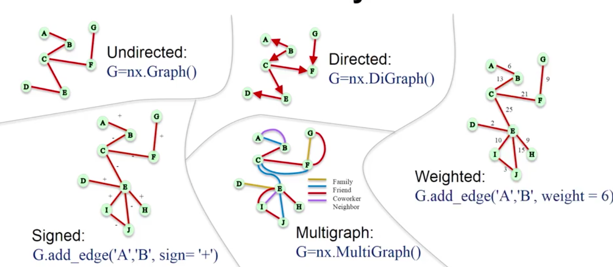
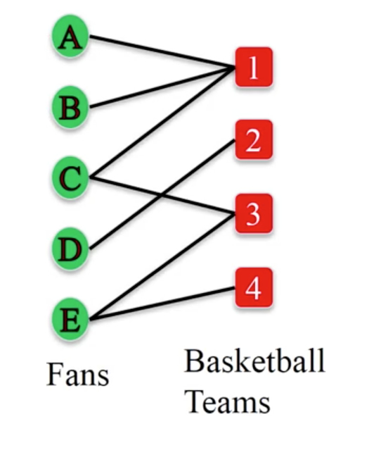

Graph Basics
============

Basic Graphs
------------

    From University of Michigan, Python for Data Science Coursera Specialization
    

.. code:: python

  # Undirected Graph
  G = nx.Graph()
  G.add_edge('A','B')
  G.add_edge('B','C')
  
  
  # Directed Graph
  D = nx.DiGraph()
  D.add_edge('B','A')
  D.add_edge('B','C')
  # Check
  D.is_directed()
  # True
  
  # Multi-Graph
  M = nx.MultiGraph()
  M.add_edge('B','A')
  M.add_edge('B','C')
  # Check
  M.is_multigraph()
  # True

Bipartite Graph
---------------

Bipartite graph is a special network where there are two set of nodes, and nodes within each set have no edges between each other.

    From University of Michigan, Python for Data Science Coursera Specialization
    
    
To create a bipartite graph:

.. code:: python

    from networkx.algorithms import bipartite

    B = nx.Graph()
    # Add nodes
    B.add_nodes_from(['A','B','C','D','E'], bipartite=0)
    B.add_nodes_from([1,2,3,4], bipartite=1)
    # Add edges
    B.add_edges_from([('A',1),('B',1),('C',1),('C',3),('D',2),('E',3),('E',4)])

# check if graph is bipartite

.. code:: python

  bipartite.is_bipartite(B)
  # True

To get list of nodes with partitions

.. code:: python

  # get set of partition nodes
  bipartite.sets(B)

To check if a set of nodes is part of a bipartition of a graph:

.. code:: python

  x = set([1,2,3,4])
  print bipartite.is_bipartite_node_set(B, x)
  # True

  z = set([1,2,3,4,'A'])
  print bipartite.is_bipartite_node_set(B, z)
  # False
  

Projected Bipartite Graph
--------------------------

For each partition of a Bipartite Graph, it is possible to generate a projected graph where one set of nodes have common edges to 
the other set of nodes.

.. code:: python

  B = nx.Graph() 
  B.add_edges_from([('A',1), ('B',1), ('C',1),('D',1),('H',1), \
                      ('B', 2), ('C', 2), ('D', 2),('E', 2), ('G', 2), ('E', 3), \
                      ('F', 3), ('H', 3), ('J', 3), ('E', 4), ('I', 4), ('J', 4) ])

  # set of nodes to generate a projected graph from a partition
  X = set(['A','B','C','D', 'E', 'F','G', 'H', 'I','J']) 
  P = bipartite.projected_graph(B, X)

Weighted Projected Bipartite Graph
----------------------------------
It is also possible to get the the weights of the projected graph using the function below.

.. code:: python

  bipartite.weighted_projected_graph(B, X) 

Edge Types
------------------

.. code:: python

  # Weighted Edges
  W = nx.Graph()
  W.add_edge('A','B', weight=5)
  W.add_edge('B','C', weight=6)
  
  # Signed Edges 
  S = nx.Graph()
  S.add_edge('A','B', sign='+')
  S.add_edge('B','C', sign='-')

We can add edge attributes with any keys.

.. code:: python
  
  # Edge Attributes
  R = nx.Graph()
  R.add_edge('A','B', relation='friend')
  R.add_edge('B','C', relation='coworker')
  R.add_edge('B','D', relation='family')

And even add both weights & attributes

.. code:: python
  
  R.add_edge('A','B', relation='friend', weight=5)
  
Node Attributes
------------------

Same as edge attributes, nodes attributes can also be assigned with any keys.

.. code:: python

  G=nx.MultiGraph()
  G.add_node('A',role='manager')
  G.node['A']['role'] = 'team member'
  G.node['B']['role'] = 'engineer'

Joining Two Graphs
------------------

Networkx can merge two graphs together with their differing weights when the edge list are the same.

.. code:: python

  new = nx.compose(a, b)
  
  name1	  name2	  weights
  Georgia	Lee	    {u'Weight': 10}
  Georgia	Claude	{u'weight': 3,u'Weight': 90}
  Georgia	Andy	  {u'weight': 1, u'Weight': -10}
  Georgia	Pablo	  {u'Weight': 0}
  Georgia	Frida	  {u'Weight': 0}
  Georgia	Vincent	{u'Weight': 0}
  Georgia	Joan	  {u'Weight': 0}
  Lee	    Claude	{u'Weight': 0}
  
  
