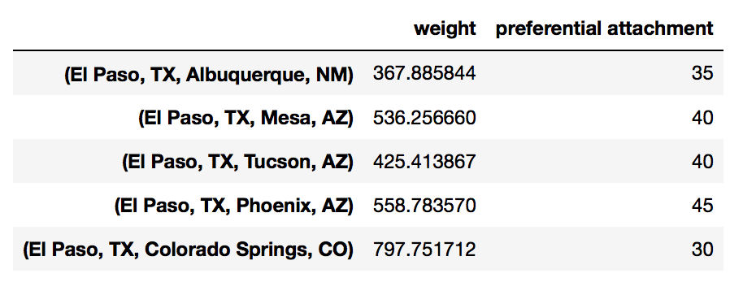
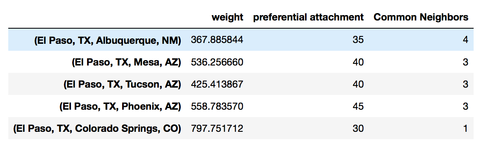

Loading Data
=====================

.. code:: python

  import networkx as nx

Formats
-------

Adjacency List
***************
If the data is in an adjacency list, it will appear like below. 
The left most represents nodes, and others on its right represents nodes that are linked to it.

.. code:: python

  0 1 2 3 5
  1 3 6
  2
  3 4
  4 5 7
  5 8
  6
  7
  8 9
  9
  
To call it from a file, we use ``nx.read_adlist``.

.. code:: python

  G2 = nx.read_adjlist('G_adjlist.txt', nodetype=int)
  G2.edges()
  
  [(0, 1),
   (0, 2),
   (0, 3),
   (0, 5),
   (1, 3),
   (1, 6),
   (3, 4),
   (5, 4),
   (5, 8),
   (4, 7),
   (8, 9)]

Edge List
***************
Edge list is just a two column representation of one node to another. It can have additional columns for weights.

.. code:: python

  [(0, 1, {'weight': 4}),
   (0, 2, {'weight': 3}),
   (0, 3, {'weight': 2}),
   (0, 5, {'weight': 6}),
   (1, 3, {'weight': 2}),
   (1, 6, {'weight': 5}),
   (3, 4, {'weight': 3}),
   (5, 4, {'weight': 1}),
   (5, 8, {'weight': 6}),
   (4, 7, {'weight': 2}),
   (8, 9, {'weight': 1})]

We can use ``nx.read_edgelist()`` to transform it into a graph network.

.. code:: python

  G4 = nx.read_edgelist('G_edgelist.txt', data=[('Weight', int)], delimiter='\t')
  

For multiple edge attributes and graph definition, we have addition definitions in the ``read_edgelist()`` function.

.. code:: python

  chess = nx.read_edgelist('chess_graph.txt', data=[('outcome', int), ('timestamp', float)], 
                           create_using=nx.MultiDiGraph())

Adjacency Matrix
*****************  

From a graph network, we can transform it into an adjacency matrix using a pandas dataframe.

.. code:: python

  import pandas as pd

  nx.to_pandas_dataframe(g, weight='distance')
  
        1.0	    2.0	    3.0	    4.0	    5.0	  6.0	    7.0     
  1.0	  0.0   	1306.0	0.0	    0.0	  2161.0	2661.0	0.0
  2.0	  1306.0	0.0	    919.0	  629.0	0.0	    0.0	    0.0
  3.0	  0.0	    919.0	  0.0	    435.0	1225.0	0.0	    1983.0
  4.0	  0.0	    629.0	  435.0	  0.0	  0.0	    0.0	    0.0
  5.0	  2161.0	0.0	    1225.0	0.0	  0.0	    1483.0	1258.0
  6.0	  2661.0	0.0	    0.0	    0.0	  1483.0	0.0	    0.0
  7.0	  0.0	    0.0	    1983.0	0.0  	1258.0	0.0   	0.0

An adjacency matrix can also be loaded back to a graph

.. code:: python

  G3 = nx.Graph(matrix)
  G3.edges()

Pickle > Graph
--------------

.. code:: python

  G = nx.read_gpickle('major_us_cities')

SQL > DataFrame > Graph
------------------------

The below code uses an edge list format.

.. code:: python

  import psycopg2
  import pandas as pd
  
  conn = psycopg2.connect(database="postgres", user="postgres", password="***", host="127.0.0.1", port="5432")

  query = """SELECT fromnode, tonode, distance from edges"""
  df = pd.read_sql_query(query, conn)
  g = nx.from_pandas_dataframe(df, 'fromnode', 'tonode', 'distance') # or edge_attr='distance'

Graph > DataFrame
------------------

Sometimes, it is necessary to convert a graph into an edge list into a dataframe to utilise pandas 
powerful analysis abilities.

.. code:: python

  df = pd.DataFrame(new.edges(data=True), columns=['name1','name2','weights'])

Note that weight attributes are in a dictionary. 

.. code:: python

  name1	  name2	  weights
  Georgia	Lee	    {u'Weight': 10}
  Georgia	Claude	{u'Weight': 90}
  Georgia	Andy	  {u'Weight': -10}
  Georgia	Pablo	  {u'Weight': 0}
  Georgia	Frida	  {u'Weight': 0}
  Georgia	Vincent	{u'Weight': 0}
  Georgia	Joan	  {u'Weight': 0}
  Lee	    Claude	{u'Weight': 0}
  
But we can easily extract the dictionary value using a map function.

.. code:: python

  df['relation'] = df['weights'].map(lambda x: x['Weight'])

**To extract node attributes into dataframe**

.. code:: python
  
  G.nodes(data=True)
  #  [('El Paso, TX', {'location': (-106, 31), 'population': 674433}),
  # ('Long Beach, CA', {'location': (-118, 33), 'population': 469428}),
  # ('Dallas, TX', {'location': (-96, 32), 'population': 1257676}),
  # ('Oakland, CA', {'location': (-122, 37), 'population': 406253}),
  # ('Albuquerque, NM', {'location': (-106, 35), 'population': 556495}),
  # ('Baltimore, MD', {'location': (-76, 39), 'population': 622104}),
  # ('Raleigh, NC', {'location': (-78, 35), 'population': 431746}),
  # ('Mesa, AZ', {'location': (-111, 33), 'population': 457587})....
 
  # Initialize the dataframe, using the nodes as the index
  df = pd.DataFrame(index=G.nodes())
  
  df['location'] = pd.Series(nx.get_node_attributes(G, 'location'))
  df['population'] = pd.Series(nx.get_node_attributes(G, 'population'))
  
  
Most of the networkx functions related to nodes return a dictionary, 
which can also easily be added to our dataframe.

.. code:: python

  df['clustering'] = pd.Series(nx.clustering(G))
  df['degree'] = pd.Series(G.degree())

.. figure:: images/load_node.png
    :width: 400px
    :align: center
    :height: 100px
    :alt: alternate text
    :figclass: align-center

    From University of Michigan, Python for Data Science Coursera Specialization

**To extract edge features into dataframe**

.. code:: python

  # Initialize the dataframe, using the edges as the index
  df = pd.DataFrame(index=G.edges())
  # [('El Paso, TX', 'Albuquerque, NM', {'weight': 367.88584356108345}),
  #  ('El Paso, TX', 'Mesa, AZ', {'weight': 536.256659972679}),
  #  ('El Paso, TX', 'Tucson, AZ', {'weight': 425.41386739988224}),
  #  ('El Paso, TX', 'Phoenix, AZ', {'weight': 558.7835703774161}),
  #  ('El Paso, TX', 'Colorado Springs, CO', {'weight': 797.7517116740046}),
  #  ('Long Beach, CA', 'Oakland, CA', {'weight': 579.5829987228403})....

  df['weight'] = pd.Series(nx.get_edge_attributes(G, 'weight'))

Many of the networkx functions related to edges return a nested data structures. 
We can extract the relevant data using list comprehension.

.. code:: python

  df['preferential attachment'] = [i[2] for i in nx.preferential_attachment(G, df.index)]

    From University of Michigan, Python for Data Science Coursera Specialization
      
In the case where the function expects two nodes to be passed in, we can map the index to a lamda function.

.. code:: python

  df['Common Neighbors'] \
  = df.index.map(lambda city: len(list(nx.common_neighbors(G, city[0], city[1]))))

    From University of Michigan, Python for Data Science Coursera Specialization

Printing Out Data
------------------

.. code:: python

  # summary
  print(nx.info(G))
  # Name: 
  # Type: Graph
  # Number of nodes: 1005
  # Number of edges: 16706
  # Average degree:  33.2458

  # list nodes
  g.nodes()
  
  # list edges
  g.edges()
  
  # show all data, including weights and attributes
  g.nodes(data=True)
  g.edges(data=True)
  
  # number of edges / nodes
  len(g) # or g.number_of_nodes()
  g.number_of_edges()
  
  # number connections for each node
  g.degree()

